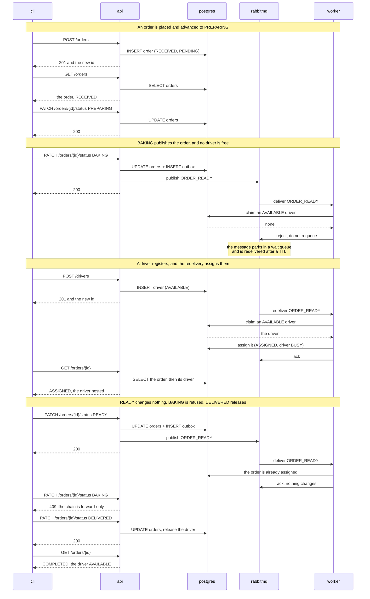

# pizza-dispatch-engine

An event-driven pizza ordering and dispatch system: a REST API accepts orders and status
changes, a message broker carries each order that becomes ready, and a worker assigns an
available driver to it.
Written in Python 3.12 with FastAPI, SQLAlchemy, PostgreSQL and RabbitMQ, and delivered as a set
of containers under a single Compose file.
Start at **Launch** — one command brings the whole system up and tests it.

## Launch

Requires Docker with the Compose v2 plugin, version 2.24 or later — check with
`docker compose version`.

```
docker compose up
```

That builds the image on the first run, then starts PostgreSQL, RabbitMQ, a one-shot service that
creates the database schema, the API, and the dispatch worker. It needs no setup and no `.env`
file: every value has a working default.

**The first launch takes about four minutes**, nearly all of it building the image. Every launch
after that reaches the test verdict in under a minute.

Once the broker and the API are healthy, the integration suite runs against the system that was
just started and prints an unmissable `PASS` or `FAIL` separator into the same stream. It runs once
and exits, and **everything else stays up either way** — a failing suite leaves you a system to
look at rather than a torn-down one.

**As a CI-style gate**, where what matters is an exit code rather than a demonstration, launch
detached and then wait on the test service:

```
docker compose up -d
docker compose wait tests
```

`docker compose wait` blocks until that service's container stops and returns its exit code. The
stack is left running, so a gate that wants it gone ends with `docker compose down`.

The database and the broker are deliberately kept out of this stream, so what you see is the API,
the worker and the test run. Their logs are still collected — `docker compose logs postgres`.

The API is published on the host at **http://localhost:8000**:

- `GET /health` — `200` while the database is reachable, `503` otherwise
- `/docs` — the generated OpenAPI document, which is the contract in full

If port 8000 is already taken, copy `.env.example` to `.env` and set `API_HOST_PORT` to something
else. Nothing inside the environment changes; only the host side moves.

After changing anything under `src/` or `tests/`, rebuild with `docker compose up --build`: the
images carry their own copy of the code, so a launch without it runs what was there before.

`.env.example` lists every value the services read, each already supplied with a working default by
`docker-compose.yml` — copy it to `.env` to override any of them; `.env` is never committed, and the
credentials in it are local defaults for a disposable environment rather than secrets.

To stop and reset, `docker compose down`. There are no named volumes, so that deletes the data along
with the containers and the next `up` starts from empty. Stopping with `Ctrl-C` keeps everything —
the containers still exist, and only `down` removes them. That is deliberate: every launch starts
from a known state, no orders and no drivers, which is what makes a run reproducible.

## Using the CLI

The client runs as a container on the same network as the API, and is not started by `up`:

```
docker compose run --rm cli
```

**On Windows, run this from PowerShell or CMD.** From Git Bash it commonly fails with
`the input device is not a TTY`; prefixing the command with `winpty` also works.

The run below is the one that shows every behaviour the system has. It uses two terminals — the
first is the one you launched in, the second is the CLI.

| # | Terminal | Do this | What you should see |
|---|---|---|---|
| 1 | 1 | `docker compose up` | the stack starts, the suite runs, `PASS` |
| 2 | 2 | `docker compose run --rm cli` | the menu |
| 3 | 2 | place an order | `201`, and the new order's id |
| 4 | 2 | list orders, select yours by customer name | status `RECEIVED`, assignment `PENDING` |
| 5 | 2 | advance it to `PREPARING` | `200` |
| 6 | 2 | advance it to `BAKING` | the order is published for dispatch — **see below** |
| 7 | 2 | register a driver | the driver is created `AVAILABLE` |
| 8 | 1 | wait one retry cycle, about eight seconds | the worker's dispatch line |
| 9 | 2 | re-read the order | the driver nested in it, `ASSIGNED`, with a timestamp |
| 10 | 2 | advance it to `READY` | a second publish; in terminal 1 the worker acks and changes nothing |
| 11 | 2 | try `BAKING` again | `409` — the chain is forward-only and single-step |
| 12 | 2 | advance to `DELIVERED`, then re-read | assignment `COMPLETED`, and the driver back to `AVAILABLE` |
| 13 | 2 | quit, then `docker compose down` | a clean reset |

**Step 6 has two correct outcomes, and which one you get depends on the driver pool.** After a
clean launch no driver is available, so the worker logs a warning and rejects the message to a wait
queue, which redelivers it after a short delay — that is what steps 7 and 8 then resolve, and it is
the most interesting path in the system. If a driver *is* already available, the order is assigned
immediately and steps 7 and 8 have nothing to do. Neither is a failure.

## How it works

One order, from the moment it is placed to the moment it is delivered — the path the steps above
walk. Five participants, named after their Compose services, so a line here and
`docker compose logs worker` use the same word.



Two things worth reading twice. **`UPDATE orders + INSERT outbox` is one transaction** — the status
change and the record of the event it raises commit together or not at all. And **the publish
happens after that commit**, which is the trade-off named below: if the broker is unreachable the
status change still succeeds and the event is lost, with the outbox row left as the evidence.

## Tests

The suite runs automatically on every `docker compose up`, against the live stack, and prints its
verdict into the launch stream. Five test functions covering four scenarios, driven entirely over
HTTP:

| Scenario | What it covers |
|---|---|
| A complete order lifecycle | one order from `RECEIVED` to `DELIVERED`, assigned at `BAKING`, unchanged by the second event at `READY`, and its driver released at the end |
| Recovery when a driver registers | an order that reaches `BAKING` with no driver available waits, and is dispatched once one registers — with nothing asked of the system again |
| One driver, two orders | only one of the two is assigned, and the other is picked up when the first is delivered |
| API rule enforcement | a skipped or repeated status change is refused with `409`, and malformed input with `422` |

**Re-reading a run.** The test container exits but is not removed, so `docker compose logs tests`
returns the whole run — scenario names, durations, and any failure — with the API and worker lines
that interleaved it stripped away. To run one scenario again, or the suite with different
arguments, start a fresh container from the same image against the live stack:

```
docker compose run --rm tests pytest tests/integration -k lifecycle
```

**No report file is written.** Adding `--junit-xml=<path>` to the test service's command would
produce one; it is left out because nothing in this project reads it, and it would hold less than
the logs above already do.

Beside it, `tests/unit` holds pure-logic tests that need nothing running. They are not part of the
launch, and are not counted among the four scenarios above.

**The suite is deterministic on a clean `docker compose up`.** It registers its own drivers and
leaves none behind, so it can be re-run. What it cannot be isolated from is the driver pool, which
is global by nature — so re-running it against a stack you have been driving by hand may observe
drivers you registered yourself. `docker compose down` resets it.
