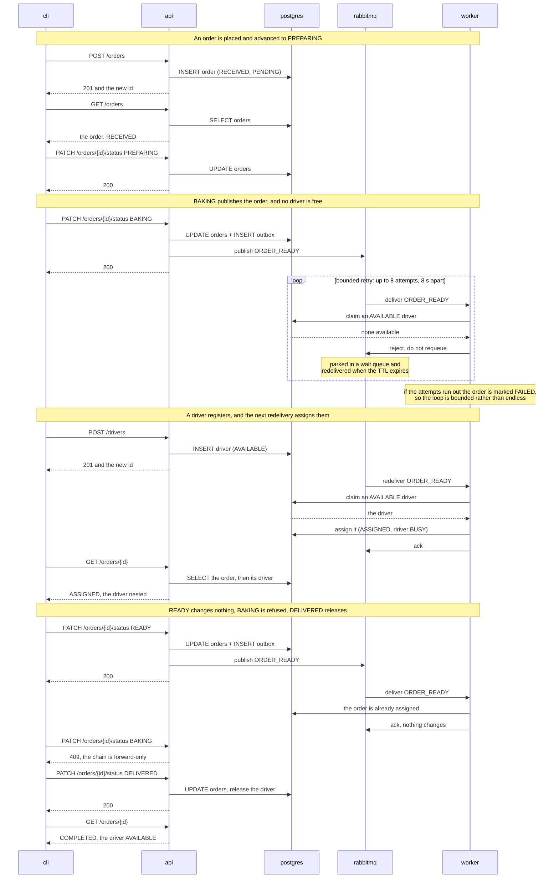

# pizza-dispatch-engine

An event-driven pizza ordering and dispatch system: a REST API accepts orders and status
changes, a message broker carries each order that becomes ready, and a worker assigns an
available driver to it.
Written in Python 3.12 with FastAPI, SQLAlchemy, PostgreSQL and RabbitMQ, and delivered as a set
of containers under a single Compose file.
Start at **Launch** — one command brings the whole system up and tests it.

## Launch

Requires Docker with the Compose v2 plugin, version 2.24 or later — check with
`docker compose version`.

```
docker compose up -d
docker compose wait tests
```

That builds the image on the first run, starts PostgreSQL, RabbitMQ, a one-shot service that
creates the database schema, the API and the dispatch worker, and then — once the broker and the
API are healthy — runs the integration suite against the system it has just started. It needs no
setup and no `.env` file: every value has a working default.

`docker compose wait` blocks until the suite finishes and **returns its exit code**, so this form
is also the CI gate: `0` means the system came up and proved itself. The stack is left running
either way, so a failing suite leaves you a system to look at rather than a torn-down one.

**The first launch takes about four minutes**, nearly all of it building the image. Every launch
after that reaches the verdict in under a minute.

To watch it happen instead, run it in the foreground — the same launch, with the services' logs and
an unmissable `PASS` or `FAIL` separator printed into the stream as it goes:

```
docker compose up
```

The database and the broker are deliberately kept out of this stream, so what you see is the API,
the worker and the test run. Their logs are still collected — `docker compose logs postgres`.

The API is published on the host at **http://localhost:8000**:

- `GET /health` — `200` while the database is reachable, `503` otherwise
- `/docs` — the generated OpenAPI document, which is the contract in full

If port 8000 is already taken, copy `.env.example` to `.env` and set `API_HOST_PORT` to something
else. Nothing inside the environment changes; only the host side moves.

After changing anything under `src/` or `tests/`, rebuild with `docker compose up --build`: the
images carry their own copy of the code, so a launch without it runs what was there before.

`.env.example` lists every value the services read, each already supplied with a working default by
`docker-compose.yml` — copy it to `.env` to override any of them; `.env` is never committed, and the
credentials in it are local defaults for a disposable environment rather than secrets.

To stop and reset, `docker compose down`. There are no named volumes, so that deletes the data along
with the containers and the next `up` starts from empty. Stopping with `Ctrl-C` keeps everything —
the containers still exist, and only `down` removes them. That is deliberate: every launch starts
from a known state, no orders and no drivers, which is what makes a run reproducible.

## Using the CLI

The client runs as a container on the same network as the API, and is not started by `up`:

```
docker compose run --rm cli
```

**On Windows, run this from PowerShell or CMD.** From Git Bash it commonly fails with
`the input device is not a TTY`; prefixing the command with `winpty` also works.

The run below is the one that shows every behaviour the system has. It uses two terminals — the
first is the one you launched in, the second is the CLI.

| # | Terminal | Do this | What you should see |
|---|---|---|---|
| 1 | 1 | `docker compose up` | the stack starts, the suite runs, `PASS` |
| 2 | 2 | `docker compose run --rm cli` | the menu |
| 3 | 2 | place an order | `201`, and the new order's id |
| 4 | 2 | list orders, select yours by customer name | status `RECEIVED`, assignment `PENDING` |
| 5 | 2 | advance it to `PREPARING` | `200` |
| 6 | 2 | advance it to `BAKING` | the order is published for dispatch — **see below** |
| 7 | 2 | register a driver | the driver is created `AVAILABLE` |
| 8 | 1 | wait one retry cycle, about eight seconds | the worker's dispatch line |
| 9 | 2 | re-read the order | the driver nested in it, `ASSIGNED`, with a timestamp |
| 10 | 2 | advance it to `READY` | a second publish; in terminal 1 the worker acks and changes nothing |
| 11 | 2 | try `BAKING` again | `409` — the chain is forward-only and single-step |
| 12 | 2 | advance to `DELIVERED`, then re-read | assignment `COMPLETED`, and the driver back to `AVAILABLE` |
| 13 | 2 | quit, then `docker compose down` | a clean reset |

**Step 6 has two correct outcomes, and which one you get depends on the driver pool.** After a
clean launch no driver is available, so the worker logs a warning and rejects the message to a wait
queue, which redelivers it after a short delay — that is what steps 7 and 8 then resolve, and it is
the most interesting path in the system. If a driver *is* already available, the order is assigned
immediately and steps 7 and 8 have nothing to do. Neither is a failure.

## How it works

One order, from the moment it is placed to the moment it is delivered — the path the steps above
walk. Five participants, named after their Compose services, so a line here and
`docker compose logs worker` use the same word.



Two things worth reading twice. **`UPDATE orders + INSERT outbox` is one transaction** — the status
change and the record of the event it raises commit together or not at all. And **the publish
happens after that commit**, which is the trade-off named below: if the broker is unreachable the
status change still succeeds and the event is lost, with the outbox row left as the evidence.

## Tests

The suite runs automatically on every `docker compose up`, against the live stack, and prints its
verdict into the launch stream. Five test functions covering four scenarios, driven entirely over
HTTP:

| Scenario | What it covers |
|---|---|
| A complete order lifecycle | one order from `RECEIVED` to `DELIVERED`, assigned at `BAKING`, unchanged by the second event at `READY`, and its driver released at the end |
| Recovery when a driver registers | an order that reaches `BAKING` with no driver available waits, and is dispatched once one registers — with nothing asked of the system again |
| One driver, two orders | only one of the two is assigned, and the other is picked up when the first is delivered |
| API rule enforcement | a skipped or repeated status change is refused with `409`, and malformed input with `422` |

**Re-reading a run.** The test container exits but is not removed, so `docker compose logs tests`
returns the whole run — scenario names, durations, and any failure — with the API and worker lines
that interleaved it stripped away. To run one scenario again, or the suite with different
arguments, start a fresh container from the same image against the live stack:

```
docker compose run --rm tests pytest tests/integration -k lifecycle
```

**No report file is written.** Adding `--junit-xml=<path>` to the test service's command would
produce one; it is left out because nothing in this project reads it, and it would hold less than
the logs above already do.

Beside it, `tests/unit` holds pure-logic tests that need nothing running. They are not part of the
launch, and are not counted among the four scenarios above.

**The suite is deterministic on a clean `docker compose up`.** It registers its own drivers and
leaves none behind, so it can be re-run. What it cannot be isolated from is the driver pool, which
is global by nature — so re-running it against a stack you have been driving by hand may observe
drivers you registered yourself. `docker compose down` resets it.

## Trade-offs

Nine choices a reviewer might otherwise read as mistakes. Each says what was chosen, what was
rejected, and what it costs.

**RabbitMQ and PostgreSQL, chosen as a pair.** The brief asks for a message broker and a database
without naming either. RabbitMQ gives per-message acknowledgement, dead-lettering and a delay
primitive, which is exactly the retry mechanism this problem needs; Kafka's log model would have
turned a redelivery-after-a-delay into partition-level replay. PostgreSQL follows from the shape of
the data rather than from transactions, which a document store would also give: orders and drivers
are a fixed, related schema, an order **references** a driver and a driver may hold only one active
order, and those are foreign keys and unique constraints — rules the database enforces rather than
rules the application hopes it applied. Modelling the same thing in a document store means either
embedding a driver in every order and keeping the copies in step, or holding the reference anyway
with nothing checking it. The cost is two pieces of infrastructure to run rather than one — paid by
Compose, and by nothing else.

**A synchronous runtime, chosen once for the whole system rather than a layer at a time.** Async is
not a choice a layer makes: the transaction protocol, every repository, every use case and both
composition roots convert together, the drivers change with them, and the unit tests acquire a
plugin that costs them the "free" standing they are admitted under. Only the domain layer would be
untouched. **What the chosen side costs is named rather than glossed:** the publisher needs a lock
because the runtime is synchronous, and a status update against an unreachable broker occupies a
pool thread for up to twice the configured timeout. The condition that reverses it is real
concurrency — worker replicas, or a prefetch above one.

**Retry through a dead-letter exchange and a TTL, not an immediate requeue.** A message that finds
no free driver is rejected without requeue, parked in a queue with a time-to-live, and returned to
the worker when it expires — a fixed delay, a capped number of attempts, and the order marked
failed when they run out. An immediate requeue was rejected because it spins: the same message
would come back thousands of times a second while no driver appears. The cost is that the delay is
a queue-level property, so one number serves every retry rather than backing off.

**The publish happens after the commit.** The status change and its outbox row commit together, and
only then is the event sent — so a broker that is down cannot roll back a change the caller has
already been told succeeded. The accepted cost is a genuinely lost event: the status update returns
`200`, the order stays `PENDING`, and the outbox row is the record that it happened. **You can
prove this rather than take it on trust** — `docker compose stop rabbitmq`, then advance an order to
`BAKING`: `200`, and no dispatch. A relay that republishes unsent rows is the fix, and it is future
work rather than a defect.

**A migration tool acts on a schema holding data that must survive the change, and this one holds
none.** With nothing persisted the schema is built from empty at every launch, so there is never a
second version for a revision to describe — Alembic would ship one revision documenting a
capability nothing exercises. The schema is created from the model by a one-shot service instead.
What reverses it is persistence, which this environment deliberately does not have.

**A CI server is shared infrastructure, not a service this repository defines.** The compose file
describes the system under test; a build server is provisioned once and pointed at many
repositories, so its shape here is an installation that already exists, aimed at this remote, with
the job definition committed beside the code. **Every check such a pipeline would run already runs**
— formatter, linter, type checker and unit tests before each commit, and the integration suite
inside the launch. What is missing is the trigger, not a check. A Jenkins service was priced before
it was declined: a plugin set able to drive those commands builds in about nine minutes from a clean
cache and adds 74 MB to a 483 MB base image, paid by whoever launches this first; the server-free
tool that would have validated a pipeline without one has had no release since a 2023 beta. The cost
of the gap is a check skipped locally with nothing to catch it — which one author carries by
discipline and a team cannot.

**Every launch starts from empty, which is the property an ephemeral test environment exists to
provide.** Nothing is persisted, so no run inherits another's residue and the suite always meets a
known state. That is why there is no second stack: a duplicate environment with its own database and
broker would double what runs in order to remove one failure — re-running the suite after driving
the system by hand — that a single documented `docker compose down` already removes. Testing the
system that actually ships is also worth more than testing a faithful copy of it. The cost is that
determinism is conditional rather than absolute, and the condition is written down under *Tests*
rather than glossed over.

**One worker, and nothing in the code assumes it.** A single replica at prefetch one keeps the demo
and the suite readable — messages are handled in a visible order, and a scenario's timing is not a
function of which consumer won. The safety that would matter under contention lives in the database
rather than in the deployment: claiming a driver is an atomic conditional update, so two workers
could not take the same one. What is missing is the evidence, not the safety — running replicas and
proving it under real contention is future work.

**No test reaches around the thing it claims to verify.** The integration suite asserts through the
API rather than reading the schema behind it, the unit tests use no doubles, and the retry path is
exercised by letting the real broker redeliver rather than by moving a clock or opening an interface
for the test to push. Each of those was decided separately and they amount to one rule: a suite that
shortcuts past the contract stops testing the contract. The cost is real and accepted — the
publisher and transaction failure paths are reached by breaking infrastructure by hand, as in the
experiment above, rather than on demand.

### What a reviewer will look for and not find

No authentication or authorisation. No driver endpoints beyond registration — no listing, no
availability changes, no per-driver history. No filtering or paging on the order list. No structured
order items; `items` is a list of strings. No metrics, no tracing, no correlation id across the
broker. No isolated test environment — the suite runs against the stack you drive by hand.

Each of these was considered and consciously excluded. [docs/future-work.md](docs/future-work.md)
holds the full register, ordered by what a reviewer is most likely to expect.

The reasoning behind every choice above, in full and with the alternatives that were weighed, is in
[.claude/plans/02-decisions.md](.claude/plans/02-decisions.md); how that record was produced is in
[docs/how-this-was-built.md](docs/how-this-was-built.md).

## Assumptions

Where the brief was silent or genuinely ambiguous, a reading was chosen and written down.

- The dispatch event fires on both `BAKING` and `READY`, and assigning an order twice is a no-op.
- The status chain is strictly linear, single-step and forward-only, and `DELIVERED` is terminal.
- Reaching `DELIVERED` releases the driver back to `AVAILABLE`.
- A driver is always registered `AVAILABLE`; the request carries no status field.
- `items` is a list of strings, with arbitrary but explicit length bounds.
- A driver holds at most one active order.
- `GET /orders` exists — a light list, newest first, with no cap and no paging.
- `GET /health` exists — `200` when the database is reachable, `503` otherwise.
- "3–4 automated tests" means four integration scenarios; the unit tests are separate and uncounted.
- The environment is disposable: no named volumes, and `docker compose down` is the whole reset.
- No authentication or authorisation anywhere.
- The event is published after the commit, so an unreachable broker still returns `200` and the
  event is lost.
- Every event is recorded in an `outbox` table, but nothing replays unpublished rows.
- "Microservice" means separate processes and containers, not separate codebases — the API and the
  worker are two entrypoints into one package over one database.
- The committed credentials are non-secret defaults for a disposable environment; a real deployment
  would supply its own.
